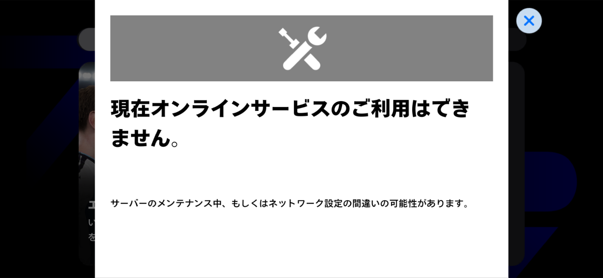

eFootballのオンライン対戦ができなくなった

何かネットワーク設定で変えたことといえば、

自宅にAdguard Homeを導入したくらいである...

## 結論

- Adguard HomeのUpstream DNSの設定が原因
- これを8.8.8.8に変更したらオンライン対戦ができるようになった

## 問題の切り分け

### そもそもAdguard Homeが原因なのかを検証

- 4G回線で試してみると、オンライン対戦ができる。
- Wi-Fi環境で、DNSサーバを8.8.8.8(Googleが提供するDNS)に変更してみると、問題なくオンライン対戦ができるようになった。

→　Adguard Homeが原因！

### Adguard Homeのフィルタリングが原因なのかを検証

Adguard Homeのフィルタリングをオフにした状態で試合をしてみても、できない

→　Adguard Homeのフィルタリングは無罪！

検証中にeFootballのオンライン対戦のマナーレベルがBに下がってしまった。

代償は思ったより大きい。

### 他のAdguard Homeの設定が原因なのかを検証

Upstream DNSを変更してみる

- デフォルトでは、https://dns10[.]quad9.net/dns-queryが設定されていた
- これを8.8.8.8に変更してみる

試合できた！！

ちなみに、https://dns10[.]quad9.net/dns-queryは、Quad9が提供するDNSで、セキュリティに特化したDNS

なので、eFootballのオンライン対戦に必要なドメインがセキュリティ的に問題があると判断されてしまい、アクセスできなくなっていたのだろう。

## まとめ
- Adguard HomeのUpstream DNSの設定が原因で、eFootballのオンライン対戦ができなくなった
